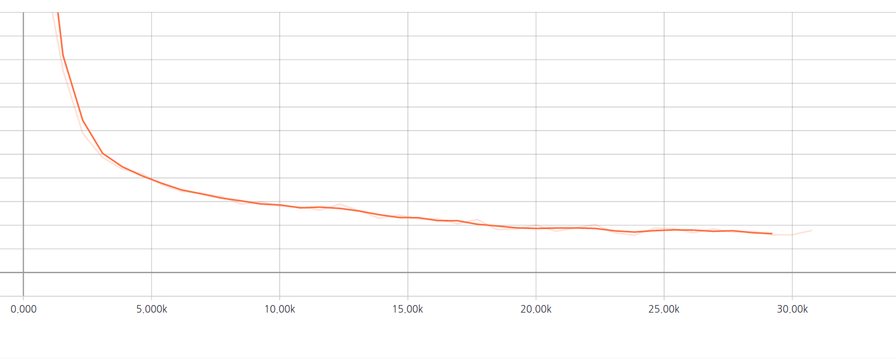

# Can Convolutional Neural Networks Crack Sudoku Puzzles?

Sudoku is a popular number puzzle that requires you to fill blanks in a 9X9 grid with digits so that each column, each row, and each of the nine 3×3 subgrids contains all of the digits from 1 to 9. There have been various approaches to solving that, including computational ones. In this project, I show that simple convolutional neural networks have the potential to crack Sudoku without any rule-based postprocessing.

## Requirements
  * NumPy >= 1.11.1
  * TensorFlow == 1.1
	
## Background
* To see what Sudoku is, check the [wikipedia](https://en.wikipedia.org/wiki/Sudoku)
* To investigate this task comprehensively, read through [McGuire et al. 2013](https://arxiv.org/pdf/1201.0749.pdf).

## Dataset
* 1M games were generated using `generate_sudoku.py` for training. I've uploaded them on the Kaggle dataset storage. They are available [here](https://www.kaggle.com/bryanpark/sudoku/downloads/sudoku.zip).
* 30 authentic games were collected from http://1sudoku.com.

## Model description
* 10 blocks of convolution layers of kernel size 3.

## File description
  * `generate_sudoku.py` create sudoku games. You don't have to run this. Instead, download [pre-generated games](https://www.kaggle.com/bryanpark/sudoku/downloads/sudoku.zip).
  * `hyperparams.py` includes all adjustable hyper parameters.
  * `data_load.py` loads data and put them in queues so multiple mini-bach data are generated in parallel.
  * `modules.py` contains some wrapper functions.
  * `train.py` is for training.
  * `test.py` is for test.
  

## Training
* STEP 1. Download and extract [training data](https://www.kaggle.com/bryanpark/sudoku/downloads/sudoku.zip).
* STEP 2. Run `python train.py`. Or download the [pretrained file](https://www.dropbox.com/s/ipnwnorc7nz5hpe/logdir.tar.gz?dl=0).

## Test
* Run `python test.py`.

## Evaluation Metric

Accuracy is defined as 

Number of blanks where the prediction matched the solution / Number of blanks.

## Results

After a couple of hours of training, the training curve seems to reach the optimum. 

I use a simple trick in inference. Instead of cracking the whole blanks all at once, I fill in a single blank where the prediction is the most probable among the all predictions. As can be seen below, my model scored 0.86 in accuracy. Details are available in the `results` folder.

 
| Level  |  Accuracy (#correct/#blanks=acc.) |
| ---    |---     |
|Easy|**47/47 = 1.00**|
|Easy|**45/45 = 1.00**|
|Easy|**47/47 = 1.00**|
|Easy|**45/45 = 1.00**|
|Easy|**47/47 = 1.00**|
|Easy|**46/46 = 1.00**|
|Medium|33/53 = 0.62|
|Medium|**55/55 = 1.00**|
|Medium|**55/55 = 1.00**|
|Medium|**53/53 = 1.00**|
|Medium|33/52 = 0.63|
|Medium|51/56 = 0.91|
|Hard|29/56 = 0.52|
|Hard|**55/55 = 1.00**|
|Hard|27/55 = 0.49|
|Hard|**57/57 = 1.00**|
|Hard|35/55 = 0.64|
|Hard|15/56 = 0.27|
|Expert|**56/56 = 1.00**|
|Expert|**55/55 = 1.00**|
|Expert|**54/54 = 1.00**|
|Expert|**55/55 = 1.00**|
|Expert|17/55 = 0.31|
|Expert|**54/54 = 1.00**|
|Evil|**50/50 = 1.00**|
|Evil|**50/50 = 1.00**|
|Evil|**49/49 = 1.00**|
|Evil|28/53 = 0.53|
|Evil|**51/51 = 1.00**|
|Evil|**51/51 = 1.00**|
|Total Accuracy| 1345/1568 = _0.86_|

